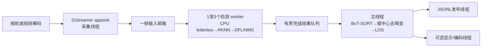

# 代码架构：检测、跟踪与 LOS

本文依据本轮改造前的 Git `HEAD:src/main.cc`、保留的旧实现及当前实际编译文件整理。性能判断以计时结果为准；源码中出现 DMA、RGA 或 MPP 不等于整条链路零拷贝。

## 改造前

调用链：`main → OpenCV VideoCapture → rknnPool::put → ThreadPool → Yolo11::infer → resize_rga → rknn_inputs_set/run/outputs_get → post_process → rknnPool::get → Visualizer::draw → VideoWriter::write`。

- 主线程同时采集、提交、等待结果、绘框和输出。三个工作线程处理不同帧，每项任务完整执行预处理、NPU 推理和 CPU 后处理；模型实例通过轮转选择与互斥锁保护，并非工作线程固定绑定实例。三个上下文分别指定 NPU core 0/1/2。
- 任务队列、future FIFO、原图 FIFO 本身没有统一容量约束。主循环在原图队列 `size > 3` 才取首个结果，正常取出前有四帧；已完成的首帧也必须等第四帧到达。`rknnPool::get` 持队列锁等待最旧 future，存在队头阻塞。结果与图像仅依靠提交顺序配对，没有贯穿全链路的 frame ID 或图像时间。
- 相机管线为 MJPEG→`mppjpegdec`，文件管线为 H.264→`mppvideodec`，再经 `videoconvert` 成 BGR。管线没有显式统一限制各层缓存。`MppDecoder.cc` 没有参与旧 CMake 构建，且缺少其引用的头文件；实际硬解来自 GStreamer 插件。
- RGA 将原始 BGR 直接拉伸成模型 RGB，不做 letterbox。目标 DMA 缓冲按模型实例复用，RGA handle 每帧导入/释放；送入 RKNN 的是缓冲的虚拟地址，仍调用普通 `rknn_inputs_set`，没有 FD I/O 绑定。`cv::Mat` 入队共享像素存储；解码/转换/运行库内部的复制不能仅凭应用代码断言不存在。
- 后处理固定五类，仅实现 INT8 分支；绘框、显示或 MPP 编码/RTSP 推送均在主线程感知路径上。代码只统计 FPS，因此旧调度主要服务多帧吞吐，而非单帧结果时延。

旧 `Yolo11.cc`、`preprocess.cc`、`postprocess.cc`、`dma_alloc.cpp`、`Visualizer.cc`、`rknnPool.hpp` 和 `ThreadPool.hpp` 保留供对照，当前新程序不编译/调用这些模块。

## 当前模块

| 文件/目录 | 职责 |
|---|---|
| [`src/main.cc`](../src/main.cc)、[`src/app_config.cpp`](../src/app_config.cpp) | 唯一入口；加载配置、创建线程、结果按序进入跟踪器、计算 LOS、交给输出端并汇总延迟 |
| [`include/aerial/pipeline.hpp`](../include/aerial/pipeline.hpp) | 帧/检测包及其时间戳、解码缓冲所有权、单槽邮箱、检测结果顺序保护 |
| [`src/capture.cpp`](../src/capture.cpp) | 直接使用 GStreamer appsink；输入文件/相机/自定义管线、图像映射、PTS 与单调时间映射 |
| [`src/yolov8.cpp`](../src/yolov8.cpp) | 每 worker 独立 RKNN 上下文；模型契约检查、同步推理、输出资源管理和阶段计时 |
| [`include/aerial/rknn_input.hpp`](../include/aerial/rknn_input.hpp) | 显式 FP16 输入优化：验证 native 布局，RGB/255→FP16，保留普通 UINT8 输入作为对照与 INT8 路径 |
| [`src/yolo_decode.cpp`](../src/yolo_decode.cpp) | CPU RGB letterbox、split-head DFL 解码、低分候选保留、分类别 NMS、原图坐标还原 |
| [`src/bot_sort.cpp`](../src/bot_sort.cpp) | 可追溯的 BoT-SORT C++ 移植：Kalman、全局分配、两阶段关联、GMC、轨迹生命周期及实际时间间隔 |
| [`src/los.cpp`](../src/los.cpp) | 真实标定校验、分辨率适配、框中心去畸变、相机 LOS 单位向量及角度 |
| [`src/output.cpp`](../src/output.cpp) | JSONL 序列化、异步结果发布；独立可选绘框/显示/视频输出 |
| `config/`、`model/` | 运行配置、相机标定模板、真实 YOLOv8n ONNX/RKNN 转换脚本与模型 manifest |
| `tests/`、`third_party/botsort/` | 模块及管线测试、JSONL 校验、固定上游源码/许可证及数值参考 |
| [`scripts/benchmark_latency.py`](../scripts/benchmark_latency.py) | 比较不同 worker/core-mask 配置的结果延迟和丢帧情况 |

构建分为 `aerial_core`（检测后处理/跟踪/LOS）、`aerial_io`（采集/输出）及 `Aerial_detection_demo`（入口/配置/RKNN 检测器）。关闭 `BUILD_RKNN_APP` 可执行不依赖 NPU 的测试；仍需 OpenCV/GStreamer 开发库。

## 当前数据流与线程

每个检测 worker 自持一个模型实例，同一实例最多一帧在途。默认 worker 数为 1，可配置 1–3；多 worker 且 core mask 为 AUTO 时分别指定 core 0/1/2。线程数和 NPU 核组合由实测选择，不预设单线程或多线程必然胜出。GStreamer、RKNN 还有各自内部执行线程。

第一版使用 OpenCV 单线程和 NPU AUTO；最新的 `config/video.yaml`、`config/camera.yaml`
已采用一个检测 worker、`core_mask: 7`、`pipeline.opencv_threads: 4` 以及 FP16 快速输入。
OpenCV 的 CPU 并行度不会增加检测上下文数量；core mask 7 请求三核执行同一帧，但模型中的算子
是否能拆分仍由 RKNN 决定。INT8 单独配置 `config/video_int8.yaml` 也保持一个检测 worker，使用
UINT8 输入。选择依据和旧配置对照见[优化实测记录](OPTIMIZATION_RESULTS.md)。

| 层次 | 实时输入/实时回放 | 离线逐帧处理 |
|---|---|---|
| appsink | `max-buffers=1, drop=true`；文件按时钟回放，相机不额外等待 sink 时钟 | 一个缓冲，背压保留每帧 |
| 输入邮箱 | 一个待处理帧，新帧替换旧帧 | 一个待处理帧，满时采集线程等待 |
| 检测在途 | 至多 worker 数；推理本身不被抢占 | 至多 worker 数 |
| 完成结果队列 | 一个最新完成结果；高水位 frame ID 拒绝迟到旧结果，不等待慢的早期推理 | 有界 map 按连续 frame ID 输出；允许下一必需帧入队以避免重排死锁 |
| JSONL 邮箱 | 一个待发布结果，新结果替换待发布旧结果 | 满时背压，保留全部结果 |
| 可选预览邮箱 | 始终一个最新结果 | 始终一个最新结果，不保证每帧视频展示 |

主线程只有一个跟踪器，接收的 frame ID 与图像时间严格前进；跳帧按实际图像时间差推进 Kalman 和超时，而非把每次处理当作相同间隔。实时模式在推理前和跟踪前检查 `max_age_ms`，过期即丢弃。frame ID 代表应用收到的有效帧序号，不是传感器硬件序号；appsink 内丢帧可通过 PTS 间隔体现，无法从该 ID 推算全部上游丢帧。

## 坐标、内存与硬件边界

检测器输出原始畸变图像的浮点 `xywh`；跟踪器处理同一坐标系，输出 Kalman 估计框，明确标记当前检测更新或纯预测。LOS 使用跟踪框中心去畸变；相机轴为 X 向右、Y 向下、Z 向前，方位向右为正、俯仰向上为正，JSON 角度单位是弧度。JSON bbox 为原图 `xyxy`。无真实标定必须显式 `--no-los`，对应 `calibrated=false, los=null`；不注入默认焦距。详见 [LOS 约定](LOS.md)、[模型契约](YOLOV8_MODEL.md)及[跟踪来源/适配](BOTSORT_PROVENANCE.md)。

采集将 `GstSample` 映射成带真实 stride 的只读 `cv::Mat`，由 `Frame.owner` 保持映射生命周期；传递帧包本身无需整幅图像 clone。可选 `--copy-input` 在检测 worker 内仅复制被选中的帧到普通 CPU 内存，以对比直接访问解码缓冲的成本；整帧复制耗时计入 `preprocess_ms`，`--no-copy-input` 关闭该复制。CPU 预处理仍产生 resize 和 RGB letterbox 缓冲，RKNN 仍使用普通输入/输出 API。应用没有直接调用 RGA 或采用 DMA FD I/O 绑定，也不保证解码颜色转换或 runtime 无复制。预览线程另行 clone 原图再绘制，并在可能阻塞编码前释放原始解码缓冲引用。

C++ 配置默认 `input_mode=uint8`，运行库处理输入转换；当前仓库 FP16 配置显式选择
`fp16_normalized`，在 CPU 上按已验证的 mean=0/std=255 契约转成归一化 FP16，再使用
`rknn_inputs_set(pass_through=1)`。转换纳入 `preprocess_ms`，随后输入提交、`rknn_run`
和输出获取分别计时。该优化没有改变检测/跟踪坐标或 letterbox，也不是共享内存绑定；
详见[输入路径实验](INPUT_PATH.md)。

MPP 通过可配置的 GStreamer `mppvideodec format=BGR`/`mppjpegdec format=BGR` 路径使用；本机插件的 BGR 格式转换在内部调用 RGA，因此“应用没有直接 RGA 调用”不代表硬件通路没有 RGA。`decoder=auto` 由 GStreamer 协商，不等于强制硬解。自定义管线的上游 queue、解码器和驱动仍可能缓存；应用邮箱容量不能代表全链路总在途帧数。

## “结果可用”的测量

`result_ready_monotonic_ns` 在跟踪和 LOS 完成后、JSON 序列化/入队及绘图编码前采样。`receiver_to_result` 从 appsink 收到图像计时，包含应用排队但不包含此前驱动/解码等待；有可映射 PTS 时额外提供 `source_to_result_estimate`。两者均不声称测到了相机曝光起点，`capture_latency_measured` 固定为 false。发布线程另记录 `publish_started_monotonic_ns`，它是开始写出时间，完整结果的外部接收时间还需消费者记录。

显示、编码及 JSON 实际写出分别在消费者线程；实时模式的慢消费者不会使感知队列无限增长，但会丢弃待发布/待显示旧结果。一个已经开始的 JSON 记录仍需按字节写完以维护 JSONL 完整性；显示/编码线程的阻塞也可能延长退出时的 join。记录这些边界，避免把“计算完成”误报成“远端已经拿到结果”。
