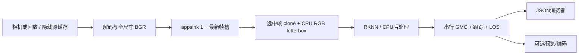
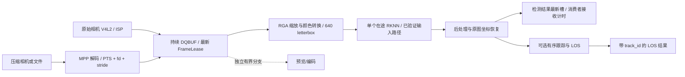

# 无人机 RK3588 实时检测：源码调研与低延迟路线

调研日期：2026-09-24。本轮只读外部源码、复算已有日志并设计路线，没有实施下述运行代码改造，也没有运行下载项目的程序。外部性能数字不是本机测试结果。源码审计使用固定提交；新增硬件方案的收益均须实测。

## 1. 推荐结论

最值得先实现的是：**可追溯的采集时间 → 持续采集/最新帧选择 → 单个在途检测 → RGA 生成小尺寸网络图像 → 已验证的 RKNN 输入路径 → 后处理完成立即发布 → 独立消费者测量实际接收年龄**。

先消除隐藏排队和全尺寸 CPU 图像搬运，再考虑 RKNN 内存共享。当前 INT8 的普通输入提交中位数仅约 0.29 ms，而选中帧复制和预处理约 10.73 ms：优化优先级明显不同。一个必要的小图复制可能比跨设备共享、cache 同步和长时间占用相机 buffer 更划算。

保留本仓库 BoT-SORT/LOS 功能，但把它们视为另一条需要有序状态更新的结果链。**检测结果可以先发布；带 track_id 的 LOS 必须等跟踪完成**，不能把检测框中心射线冒充跟踪 LOS。不要通过删除 GMC 来声称原任务已等价提速。

本轮考察范围超出用户给出的四仓库：还读了 Jetson `jetson-utils`、Raspberry Pi `picamera2`、Luxonis `depthai-core`、NVIDIA DeepStream 参考应用，以及 Rockchip 官方 Model Zoo、librga、MPP 和 `ffmpeg-rockchip` 的相关源码。DeepStream 插件本身的内部行为以官方文档为依据，不声称审计了闭源实现。

## 2. 指定仓库的真实技术与局限

完整固定提交、行号和测量复算见 [指定两仓审计](research/REQUESTED_REPOS.md)、[RK 仓库审计](research/RK_REPOS.md)、[跨平台审计](research/CROSS_PLATFORM.md)。

| 项目 | 实码中的机制 | 不能从宣传数字推出的结论 | 对本项目的价值 |
|---|---|---|---|
| OrangeKat/ZeroCopyInferenceEngine | 初始化分配 tensor/buffer、融合 CUDA 预处理、stream event 依赖；每轮 submit 后 wait | 实际存在逐帧 H2D 和三次 D2H；224 小型四卷积实验网络、随机输入不是 YOLO640/相机；两个 stream 不等于跨帧并行 | 固定池、少中间图、显式设备依赖；不移植 CUDA API 或其性能数字 |
| SuyashMullick/real-time-vision-latency-bench | 四线程、8槽 FrameData 指针池、SPSC FIFO、逐段 trace | 无空槽停止 read，满队列忙等；不是 latest-frame；计时从 read 完成到 cout 前；线程传指针不代表设备链零拷贝 | 借 trace 和所有权；把 FIFO 换成可覆盖的最新帧策略 |
| wzxzhuxi/rknn-3588-npu-yolo-accelerate-saturated | 当前代码 12 worker，每 context 单核轮转；RGA、绑定 RKNN 内存；待处理 FIFO、按 ID 取结果 | 175 FPS 属饱和吞吐；RGA 虚拟地址输出后仍复制/变换到 RKNN 内存；提交顺序等待会形成队首阻塞 | 读绑定I/O与量化输入及吞吐对照；其logical属性查询/硬编码布局不能当native模板 |
| yuunnn-w/rknn-cpp-yolo | 预建3个context，入口仅ctx0；RGA写绑定输入内存，输出转排/后处理 | 中心裁成正方形后重复推理同一图片；初始读图/颜色变换不在计时；每帧仍分配/转换输出；25 FPS不是相机端到端 | 学 native布局/RGA/DFL/NMS；不能直接迁移裁图与坐标处理到全视场LOS |

关键证据：[Orange 执行链](https://github.com/OrangeKat/ZeroCopyInferenceEngine/blob/abaef529e3797da0da61a80a53c553281673512f/src/pipeline.cpp#L135-L198)、[Suyash FIFO](https://github.com/SuyashMullick/real-time-vision-latency-bench/blob/7d5a3a52d2f250b2ff729954a34ddf76530c051f/src/pipeline/pipeline.cpp#L104-L181)。其余两个项目的版本固定为 `73c9a1bbc33193a152c749a3a24fa00627ea3be9` 和 `470b663456ca437ab6cc256bbc04c3b4e1797c7a`，详细文件链接在 RK 审计中，避免将旧版文章对应的实现与当前源码混淆。

Suyash 仓库自带 CSV 很有说明力：按它的脚本去掉最初 3 秒后仅剩 12 帧，read 后到发布前 P50=81.247 ms，其中预处理完成→推理开始排队 P50=65.743 ms；推理指标含 CPU NMS，P50=9.398 ms。此处只是重算其历史 CSV，不是复现该机器，样本也不足以证明可靠 P99。[原始 CSV](https://github.com/SuyashMullick/real-time-vision-latency-bench/blob/7d5a3a52d2f250b2ff729954a34ddf76530c051f/results/raw/uav_gpu_eval.csv)。

## 3. 其他平台真正能借鉴什么

| 来源 | 读到的行为 | RK3588 迁移方式 |
|---|---|---|
| Jetson jetson-utils | RingBuffer 的 ReadLatestOnce 跳过旧帧；NVMM/EGL 路径仍可有设备内线性复制，CPU路径也有 memcpy | 搬描述符和所有权；消费最新帧；分别记 CPU copy/device copy，不能以 zeroCopy 开关作证据 |
| Raspberry Pi Picamera2 | CompletedRequest 引用计数决定 buffer 何时归还；映射访问有 DMA cache 同步；queue=False 只取消保留一帧完成请求 | FrameLease + 正确归还时机；区分“最新已完成帧”和“请求后曝光的新帧”；metadata 时间戳要保留时钟语义 |
| Luxonis DepthAI | 设备 NN 输入与主机输出各自有 queue/blocking 设置；passthrough 绑定实际被推理的输入；慢 host callback 可能阻塞接收线程 | 源端、RGA、NPU、发布端都审计队列；同一 frame_id/时间戳贯穿；接收线程仅交换描述符 |
| NVIDIA DeepStream | mux 批量/超时是可配置等待；sample 用逐帧探针关联 source_id/frame_id | 单路实时任务不等多路凑 batch；区分计算结果和渲染时钟；不把 batching 当默认优化 |
| nyanmisaka/ffmpeg-rockchip | MPP frame 导出 fd/stride/plane/PTS，并通过 AVBuffer 引用维持寿命；RGA async FIFO 达到深度后才等待并吐出旧项 | 学跨模块元数据、引用与 fence；从最小异步深度起测，不能把 async 等同低延迟 |

跨平台代码定位见 [CROSS_PLATFORM.md](research/CROSS_PLATFORM.md)。`ffmpeg-rockchip` 的 [MPP 导出](https://github.com/nyanmisaka/ffmpeg-rockchip/blob/d90e3a1c18d7929383cf88c1b3da2e2d1c966cbf/libavcodec/rkmppdec.c#L590-L674)与 [RGA FIFO/fence](https://github.com/nyanmisaka/ffmpeg-rockchip/blob/d90e3a1c18d7929383cf88c1b3da2e2d1c966cbf/libavfilter/rkrga_common.c#L1413-L1444)值得直接读。它们比“支持零拷贝”的标签更能说明 buffer 怎么活到硬件完成。

## 4. 本仓库的真实 baseline

当前入口 `src/main.cc`：采集线程 → `FrameSlot` 最新槽 → detector worker → `CompletionQueue` → 主线程 BoT-SORT/GMC → LOS → JSON 发布线程。实时模式已不是深 FIFO；现有优化应保留，而不是重新实现一遍。

输入现在仍是 BGR `cv::Mat`：`src/capture.cpp` 把 GstSample 映射成 CPU 可访问图像；选中帧可 clone 到普通内存；`src/yolov8.cpp` 做 CPU letterbox/RGB。实际 camera 配置目前是 MJPEG/MPP 路径，没有真实相机验证；不能假设 V4L2/NV12/DMA-BUF 路径已存在。

此前 900 帧实测边界是**文件 PTS→跟踪/LOS 阶段结束**，且没有标定，LOS 为 null。将每一行减去该帧的跟踪、LOS、完成队列时间，可还原检测完成的时间差；不是拿不同阶段 P95 相减。

| 配置，640×640 | RKNN run P50 ms | 原 PTS→跟踪结果 P95 ms | 推导 PTS→检测完成 P50/P95/P99 ms |
|---|---:|---:|---|
| 原 FP16，CV1/AUTO | 29.06 | 116.95 | 64.98 / 72.92 / 73.96 |
| FP16 快速输入，CV4/mask7 | 28.62 | 96.83 | 56.49 / 64.26 / 64.80 |
| INT8，CV4/mask7 | 14.96 | 71.79 | 39.40 / 46.35 / 47.45 |

这里的检测数据只覆盖最终被发布的帧，分别为剔除 10 条预热后 259/303/487 条。没有重新跑“只检测”程序，检测结果也尚未在该时刻对外发布。后续改变流水线可能改变 CPU 竞争与选帧，不能把 46.35 ms 冒充新方案已实现的端到端成绩。[逐帧复算方法及 SHA](validation/detection_ready_reanalysis.json)、[原始实验](OPTIMIZATION_RESULTS.md)。

INT8 当前阶段 P50：采集后等待 8.86 ms、复制/预处理 10.73 ms、RKNN API 15.87 ms（run 14.96）、后处理 3.35 ms、GMC 25.93 ms。各分位数不能直接相加。这表明纯检测优先看全尺寸数据移动与选帧等待；原跟踪 LOS 任务还必须单独处理 GMC。

## 5. Baseline 与目标 pipeline

Baseline：

推荐最终形态，先实现实线检测链，再逐项试验共享内存：

RGA 输出小图后，首版仍可使用普通 `rknn_inputs_set`。证明该方案的 P95/CPU/正确性之后，再试 `rknn_create_mem_from_fd`/`rknn_set_io_mem`。无需为了把所有框都标成 zero-copy 而引入未经验证的 native tensor 变换。

## 6. 改造顺序、因果、实现与验收

### P0：先建立检测结果边界和可解释的 trace

**思路来源：Suyash 的 FrameTrace，加上对其 read 后起点/发布前终点的修正。** 当前只输出跟踪结果，检测 ready 时间仅保存在中间 packet；发布开始也不等于消费者收完。首先增设独立检测结果消息：原图框、分数、frame_id、sensor sequence、source timestamp/domain、检测完成时间、丢弃原因。保留原跟踪 LOS 消息类型。

在 `src/main.cc` 的 `detection_ready_ns` 后走轻量发布通道，不能等待画框、编码或跟踪。`src/output.cpp` 增加对应序列化/消费者回执测试，最好直接给本地消费进程打接收时间。完整记录 `capture_ts`、`dequeue_ts`、`selected_ts`、`pre_begin/end`、`input_set_begin/end`、`run_begin/end`、`get_end`、`post_end`、`publish_begin/end`、`consumer_receive`；每个设备异步阶段记录 submit 和完成，不能拿 submit 耗时冒充执行耗时。

**收益段：**检测输出摆脱 GMC 等待；不宣称 RKNN 变快。**测量：**计算 ready、发布开始、完整接收三条曲线，slow-consumer 故障注入。**技能：**C++ 数据模型/chrono、IPC、可观测性、异步 I/O。现有 JSON 在线日志可继续使用；若消费者慢到当前写出的记录也过期，流式记录不能随意中途截断，应由消费端丢过期数据或采用带序号的共享最新结果槽。

### P1：相机时间戳与新鲜度控制

**来源：Jetson ReadLatestOnce、DepthAI 每一级 queue/passthrough、Picamera2 request 生命周期。** 驱动、解码器、appsink 和应用都可能保留旧帧；只设应用队列为 1 不够。

相机到位后先 `VIDIOC_QUERYCAP/ENUM_FMT/G_FMT/G_PARM` 核实格式、分辨率、帧率、stride、多平面和实际 buffer 数。首个直接 V4L2 后端采用 streaming MMAP，加 `VIDIOC_EXPBUF` 取得可导出 fd（驱动支持时）；这与应用分配 fd 后用 `V4L2_MEMORY_DMABUF` 导入是两种方向，不能混为一谈。用 nonblocking `DQBUF` 排空当前已完成帧，保留最新合格帧并立即归还未使用旧帧；`poll/epoll` 等待新事件，避免 busy-yield。

物理采集池根据驱动最小需求起步、比较 2/3/4 等**支持的**数量；应用待处理槽固定为 1，在途检测从 1 起步。空闲 buffer 数不等于排队旧图数，不能为了“只有一帧”强行把驱动池减到 1。消费已开始的帧不能被覆盖，也不能被提前 QBUF。

检查 `V4L2_BUF_FLAG_TIMESTAMP_*` 和 `TSTAMP_SRC_*`。MONOTONIC 与 SOE/EOF 是不同问题；SOE 才表示曝光起点，EOF 不含之前曝光/读出。其他平台的 BOOTTIME/设备时钟须先映射并验证，不混用 CLOCK_MONOTONIC_RAW。GStreamer PTS、do-timestamp 或 read 完成时间不能自动升级为曝光时间。[V4L2 buffer 语义](https://docs.kernel.org/userspace-api/media/v4l/buffer.html)、[EXPBUF](https://docs.kernel.org/userspace-api/media/v4l/vidioc-expbuf.html)。

**收益段：**源端和采集后排队、frame age；FIFO 每积一帧在 30/60 Hz 下对应约 33.3/16.7 ms 的帧周期，实际等待仍取决于采样/服务节拍。**测量：**曝光/EOF→DQBUF、DQBUF→选中、设备序号跳变、各原因丢帧和更新时间间隔。**技能：**Linux ioctl/poll、V4L2 media pipeline、时钟域、C++ RAII。

已有 GStreamer 路径作为对照保留：本机版本使用 `max-buffers=1, drop=true`，相机不等待显示时钟；不要照抄新文档中本机不支持的 `leaky-type`/队列统计属性（1.28 才加入）。额外 `queue` 元素只在确需解耦时添加。[appsink 版本及缓冲说明](https://gstreamer.freedesktop.org/documentation/app/appsink.html)。

### P2：RGA 直接生成小尺寸网络输入，避开全尺寸 BGR 热路径

**来源：Orange 的融合预处理思想、yuunnn/Rockchip 的 RGA、ffmpeg-rockchip 的 fd/plane/stride 传递。** 当前先生成 1920×1080 BGR 再 clone/resize/cvtColor，处理了大量最终不会送入 NPU 的像素。

新建可表达 NV12/YUYV/RGB 的图像描述符，保存 fd、各 plane offset/bytes/stride、实际宽高、色彩矩阵与范围、owner。原始相机优先比较设备实际支持的 raw YUV/ISP 输出；压缩输入才经过 MPP，解码为可共享 NV12。RGA 对**选中的帧**缩放/颜色转换至 640 输入，尽量在兼容的作业中合并操作；letterbox 可用预填 114 的持久输出面和目标矩形写入，不能声称所有格式一条指令都支持。

先同步 RGA 版本保证正确，再测异步 fence 是否有收益。初始化导入循环 buffer，重复使用 handle；不要每帧 import/allocate/free。核对 RK3588 RGA2/RGA3 的格式、地址范围、stride 和色彩转换能力。对 RGB/BGR、BT.601/709、limited/full range、奇数尺寸、padding、缩放取整逐个对照 CPU 参考。RGA 插值不保证与 OpenCV bit-exact，除像素差外还要比较框位置、分数及标注集精度。保持网络 640 输入，不把降分辨率混入这一实验。[官方 DMA allocator](https://github.com/airockchip/librga/blob/2b32edcb97b601b25683e2941d888c8515da6d55/samples/allocator_demo/src/rga_allocator_dma_demo.cpp#L65-L113)、[RGA FAQ](https://github.com/airockchip/librga/blob/2b32edcb97b601b25683e2941d888c8515da6d55/docs/Rockchip_FAQ_RGA_EN.md)。

**收益段：**当前约 10.73 ms 的复制/预处理和 CPU/DDR 压力。可将“选中帧到小图完成 P95≤3 ms”作为待验证的工程目标，**不是已有实测或保证**；若不达标，拆开 fd import、submit、fence wait、cache sync 定位。**技能：**RGA im2d、像素布局、DMA-BUF、cache/带宽分析、图像几何。

### P3：固定 buffer 所有权，再决定要不要 RKNN 共享内存

**来源：Picamera2 引用归还、Orange 预分配、ffmpeg-rockchip 硬件引用/fence、RKNN 官方 native IO 示例。** 零拷贝不是“一个指针穿过所有模块”，每个设备必须访问正确的同一份内容，且不能在它读完前复用。

设计可移动的 `FrameLease`/`InputLease` RAII：拥有 fd/映射/导入 handle 或明确借用关系，包含 frame_id 与完整格式；池状态至少覆盖 FREE→CAPTURED→RGA_READING→RELEASED，网络输入覆盖 FREE→RGA_WRITING→NPU_READING→FREE。RGA 读取源帧结束后即可归还相机 buffer，不必等检测输出；NPU 使用的小图 buffer 则必须保留到本次同步推理结束。预览独立持有低分辨率副本或自己的 buffer 预算，不能把采集池长期占住。

CPU release/acquire 只保证 CPU 内存发布，不保证 DMA 设备已完成。CPU 映射读写需要按 exporter/API 契约执行 DMA_BUF_IOCTL_SYNC START/END；它负责 cache 一致性，不代替设备 fence。跨设备不能盲信存在隐式同步；无法证明 RKNN 导入会消费 RGA fence 时，先 `imsync` 再调用推理。[Linux DMA-BUF 同步](https://docs.kernel.org/driver-api/dma-buf.html)。

内存共享作为后续 A/B：查询 native attrs、类型、量化、布局、`size_with_stride`；评估 RKNN 自建可导出内存与外部 fd 导入，必要时仍保留小图转换。**RGA RGB UINT8 不能直接冒充 native INT8/FP16。** 当前 INT8 输入零点/scale 为 -128/1÷255，FP16 则需真实 /255；`pass_through=1` 意味着绕过转换，不是“更快且一定正确”。native 输出可能为不同布局，不能直接按现有紧凑 NCHW 索引读。官方 [create_mem 示例](https://github.com/airockchip/rknn-toolkit2/blob/v2.3.2/rknpu2/examples/rknn_api_demo/src/rknn_create_mem_demo.cpp)用于核实契约，示例 memcpy 本身也要计数。

**收益段：**预分配减少分配抖动；单独消除 inputs_set 瞄准当前约 0.29 ms 的提交开销，不能承诺消掉 15 ms run。改变 native I/O 时，还须另计归一化/转排是否转移、outputs_get 及后处理成本如何变化，不能把 0.29 ms 当所有绑定方案的收益上限。若共享导致 uncached CPU 后处理或同步更慢，应保留普通 API。**测量：**每帧分配次数、CPU/device copy 字节数、buffer占用时间、fence等待、P99、错误复用/撕裂。**技能：**C++ move/RAII、引用寿命、对齐/stride、Linux DMA-BUF、跨设备同步。

### P4：INT8 质量门槛和后处理精简

**来源：Rockchip Model Zoo 的量化/DFL/NMS；saturated 的整数域比较。** 本仓库已具备官方可追溯 INT8，但 COCO20 只是起步，尚无航拍标注集的精度认证。先补覆盖高度、小目标、逆光、抖动的校准与独立标注评估，固定模型 hash、阈值和预处理后再比较。

后处理先 profile 候选筛选、DFL、排序和 NMS。保持紧凑量化输出，在同一 per-tensor scale/zp 下尝试整数 argmax/阈值；仅对通过筛选的 cell 做 DFL，预分配候选数组，再比较 NEON、top-K 上限与分类 NMS。量化 score-sum 与 class 张量分别量化，不能未经误差证明用 sum 分支早退；改变 top-K 或阈值也可能改变召回率。现有 `src/yolo_decode.cpp` 为此保留了保守判断。

**收益段：**INT8 已把 run 从约 29 ms 降到约 15 ms；后处理当前约 3.35 ms，潜力小于前处理，放在后面。**测量：**候选数/场景复杂度与 P99、mAP/小目标召回、框中心偏差、阈值边界及同帧输出一致性。**技能：**量化数学、DFL/NMS、数据布局、SIMD、性能与精度共同验收。

### P5：有证据再增加流水线或 context，并控制尾延迟

**来源：saturated 的吞吐饱和反例、Suyash 的 FIFO 等待、ffmpeg RGA async depth。** 从单个同步 RKNN context、batch1、在途1开始。允许采集与处理并行；先试 RGA 与 NPU 的浅流水，而不是增加 12 个 worker。

对照矩阵：1 context/AUTO、1 context/mask7、必要时 2 context 各核；OpenCV 1/2/4 线程；RGA 同步/最多一个预备输入。每次只改一项，保持相同源、模型和温度条件。跨帧预处理会让等待中的小图变老，若收益不足应在 NPU 空闲时才选择最新源帧。完成结果以 frame_id/source timestamp 高水位接收，丢弃迟到旧结果，不按最早 future 等待。

不能因为采集到了更新帧，就永远丢掉刚完成的有效结果：这会在高输入帧率下饿死输出。用接受时间预算和已发布高水位判断，统计无有效结果的间隔。deadline 是应用新鲜度目标，当前 `max_age_ms=250` 只是推理/跟踪前软检查，不是发布硬截止。发布前和消费者接收时还需独立检查 age，过期明确标无效。

CPU 绑核是 A/B 参数：先核实本机大小核拓扑，依据 `perf sched`/trace-cmd 的可运行等待决定是否把关键线程放到大核、把日志/预览放到另一组核；不要直接照搬 core0–3、FIFO80+忙等，也不要默认 OpenCV 线程越多越好。记录 CPU/NPU 频率、thermal 和调度等待；SCHED_FIFO/PREEMPT_RT 只在尾延迟证明确由调度导致后再评估，不能治愈模型计算或深队列。

**收益段：**可能提升更新率和降低 AoI，也可能增加单帧 P95；无预设赢家。**测量：**P50/P95/P99、时间加权 AoI、更新间隔、乱序丢弃、CPU run-queue、温度/频率。**技能：**并发状态机、condition_variable/原子、线程亲和性、Linux perf/ftrace、实验设计。

### P6：MPP 和原有跟踪功能作为独立分支验收

原始 NV12/YUYV 输入无需 MPP。MJPEG/H.264/H.265 才做硬解，并保留编码包到解码帧的时间戳关联。学习 MPP info-change、外部 buffer group 和 frame 释放；不要把测试程序的较大池大小当低延迟默认。[官方 mpi_dec_test](https://github.com/rockchip-linux/mpp/blob/14729dd578e570e5f00fd1dd2113f5429012d64b/test/mpi_dec_test.c#L130-L174)。

对可配置编码源，比较无 B 帧、适当 GOP 和低缓冲设置；随机丢 H.264/H.265 压缩包可能破坏参考链，通常应维持解码连续性而在已解码帧层丢旧帧。硬解 async/fast/immediate-out 选项须对具体 codec 验证次序和 age，不能靠开关名称决定。

若仍需 BoT-SORT/LOS，保留单路有序 tracker 和真实 dt。尝试直接用同源 Y/灰度缩略图供 GMC，降低全尺寸 BGR 的必要性；改变缩略图尺寸、角点数量或 GMC 算法必须另跑 IDF1/HOTA/ID switch 和 LOS 稳定性评估。分支仍竞争 CPU/DDR，独立线程不等于没有性能影响。**技能：**MPP/编解码参考关系、异步资源释放、时序跟踪与多目标质量评估。

## 7. 必须一起报告的指标与实验

| 指标 | 定义/用途 |
|---|---|
| 检测服务时间 | 选中帧→后处理结束；拆开 CPU、NPU API、设备等待 |
| 图像→ready latency | 有效 capture timestamp→检测 ready；曝光未知则明确写 PTS/EOF/receive 起点 |
| 图像→消费者 latency | 同一帧源时间→消费者完整接收；异机先校时，否则分段报告 |
| 每段 queue wait | 入队/可用→真正开始；与处理耗时分开 |
| 开始/发布时 frame age | 当前时间减对应图像源时间，发现旧帧仍在被计算/输出 |
| AoI | 固定频率采样 `now - timestamp(latest accepted observation)`，包括没有新结果的时段；不能只统计输出瞬间的 age |
| 更新时间间隔 | 接收结果间隔 P95/P99/最大值、无有效观测持续时长；防止靠大量丢帧美化 latency |
| 吞吐与丢弃 | capture/decode/infer/publish 各 FPS、设备序号缺口、latest覆盖、过期、乱序、输出拥塞分别统计 |
| 内存/调度 | CPU copy/device copy bytes、分配次数、handle导入、fence/cache等待、context switch、CPU/NPU/DDR负载与温度频率 |
| 质量 | mAP/小目标召回、框中心误差；启用tracker则另报关联质量，不以一致率替代真值精度 |

从固定输入和固定模型建立 A/B，先短跑定位，再交错重复 A/B/A/B，预热单独报告。长测覆盖至少约一万条有效输出并报告样本量、P99/最大值、直方图或 ECDF；这仍不是最坏执行时间证明。不要由 12 帧或几百帧的 P99 推出长期稳定性。

场景至少包含：正常负载、目标密集导致后处理膨胀、CPU竞争、慢/断开消费者、短时解码突发、温控后稳定阶段。实验日志不能同步阻塞关键线程；采用预分配 trace 环和低优先级批量写出，记录 trace 自身丢失。

真实端到端验证：相机 metadata 能给出 SOE 时，核对驱动实现；可用受控 LED/GPIO 时间事件与结果接收端记录交叉验证时间偏差。无法验证曝光时刻时保留“到达/PTS估计”命名。曝光、rolling shutter 行读出、ISP 和接口传输是独立下限，不能被 RGA/NPU 优化消掉。

## 8. 吞吐优化与延迟优化分界

| 机制 | 主要作用 | 采用条件 |
|---|---|---|
| 最新帧替换、源端排空、deadline、高水位 | 减少等待和旧结果，直接控制新鲜度 | 同时报更新间隔，防饿死；不提前覆盖正在使用的 buffer |
| 降低复制/预处理、减少分配、INT8 | 减少服务时间或抖动，可能同时提高 FPS | 图像/模型精度与生命周期正确 |
| 多 context、多推理线程、更多在途帧 | 通常增加吞吐；单帧延迟可能变大 | 同场景消费者 AoI/P95/P99 证实收益才加 |
| 单 context 多 NPU core | 有机会缩短一次推理，但受编译图拆分影响 | 同模型逐层分工与 API实测，不能按3核除以3 |
| batching、较深异步 FIFO | 饱和吞吐、隐藏设备空隙 | 单路新鲜观测一般不等 batch；显式计等待 |
| lock-free/SPSC | 可能减少锁竞争 | 当前短锁若非瓶颈，不为标签增加复杂度 |
| “零拷贝”/DMA共享 | 减少某些复制与带宽 | 核算 cache/fence/layout/持有时间；消除的是哪次 copy 必须说清 |
| 绑核/升优先级 | 可能减少调度尾延迟 | 调度 trace 证明瓶颈；不要掩盖热降频或忙等 |

## 9. 本地落点与交付路径

| 位置 | 下一步职责 |
|---|---|
| `include/aerial/pipeline.hpp` | FrameTrace、FrameLease、图像格式/plane描述；保留最新槽/高水位语义 |
| `src/capture.cpp`、新 V4L2 后端 | 保留 GStreamer 回放基准，新增受控 DQBUF/EXPBUF/时钟元数据 |
| `src/yolov8.cpp`、新 RGA preprocessor | 把预处理从 detector 剥离为可对照 backend；保留 CPU 参考和真实 letterbox transform |
| `include/aerial/rknn_input.hpp` | native输入兼容检查、可选内存绑定；UINT8/FP16量化契约不可绕过 |
| `src/yolo_decode.cpp` | profile 后再做整数域筛选/SIMD/NMS优化；保留模型和坐标校验 |
| `src/main.cc`、`src/output.cpp` | 检测就绪单独发布、消费者年龄/过期策略、可选跟踪分支 |
| `scripts/benchmark_latency.py` | detector-ready/consumer/AoI、场景与温控元数据、长尾和丢弃统计 |
| `src/bot_sort.cpp` | 仅原跟踪任务需要时优化 GMC；不污染检测-only 基准 |

建议成果按阶段展示：①带时间轴的 baseline；②最新帧策略在过载下让 age 有界的对照；③RGA 与 CPU 的同帧质量/耗时对照；④复制和同步账本、FrameLease 生命周期图；⑤INT8 精度与延迟共同评估；⑥并发实验的 latency–update-rate 曲线；⑦十分钟以上压力/温控/慢消费者结果。每次报告必须分清“已实测、历史日志推导、待验证目标”。

## 10. 推荐阅读顺序与技能成果

1. **本地 `main.cc → pipeline.hpp → capture.cpp → output.cpp`**：先能画出每帧时间轴与资源归属；展示 C++ 线程、取消/退出、bounded queue、消息时序。
2. **Suyash trace/SPSC + Jetson RingBuffer + DepthAI LockingQueue**：比较 FIFO、latest、阻塞和覆盖策略；展示用数据证明排队而非凭 FPS猜延迟。
3. **Picamera2 CompletedRequest + V4L2/DMA-BUF 文档**：掌握 buffer 所有权与时钟域，能解释为什么 fd/指针有效不代表图像仍属于这一帧。
4. **librga allocator/resize/CSC + ffmpeg-rockchip rkmppdec/rkrga_common**：掌握格式、stride、fence、pool 和硬解硬预处理；这是 RK3588 硬件链最值得直接读的组合。
5. **Rockchip Model Zoo YOLOv8 rknpu2/postprocess + Toolkit2 native IO**：掌握张量布局/量化与硬件绑定；再读 saturated/yuunnn 的取舍和性能边界。
6. **Orange 的融合预处理/event**：学习减少中间数据与表达依赖；将 CUDA 特定实现转化为 RK 上可证明的 RGA/RKNN设计。
7. **DeepStream 示例的 mux 配置/探针**：学习 batching、显示和多源时钟会怎样改变测量终点，不要求把整套框架移植到 RK。

额外 RK 项目优先级：`airockchip/rknn_model_zoo`（正确模型合同）→`airockchip/librga`（RGA/allocator）→`rockchip-linux/mpp`（解码与资源）→`nyanmisaka/ffmpeg-rockchip`（跨模块 fd/PTS/fence）。没有把更多只报 FPS 的 demo 堆进推荐列表。直接复用外部代码前按固定 tree 的实际 LICENSE 核对；审计笔记保留了 README 与许可证不一致的情况。
